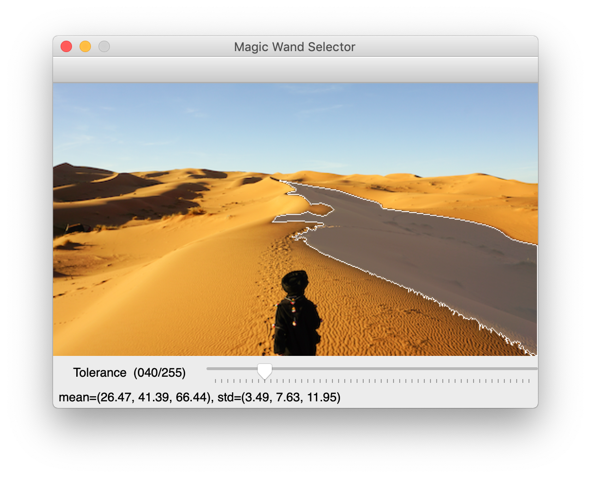

## magicwand

Flood filling masking tool.

Displays an image with a tolerance trackbar. A user can click anywhere on the image to seed a selection, where the range of allowable deviation from a color is given by the trackbar value. The mean and standard deviation of the selected region is displayed in the window's status bar.



## Getting Started

Install into a Python virtual environment, as you would any other Python project.

```sh
$ python3 -m venv venv
$ source venv/bin/activate
(venv) $ pip install git+https://github.com/alkasm/magicwand
```

Run the module as a script on any image you want:

```sh
(venv) $ python3 -m magicwand path/to/image.png
```

## Usage

As a script, just run the module directly as above. You can always check the `--help` flag when running the module as a script for more info:

```sh
(venv) $ python3 -m magicwand --help
usage: magic wand selector [-h] image

positional arguments:
  image       path to image

optional arguments:
  -h, --help  show this help message and exit
```

Use inside your own Python projects:

```python
>>> from magicwand import SelectionWindow
>>> import cv2 as cv
>>> 
>>> img = cv.imread("lane.jpg")
>>> window = SelectionWindow(img)
>>> window.show()
>>> 
>>> print(f"Selection mean: {window.mean[:, 0]}.")
Selection mean: [106.76420172  93.78792503  89.71121334].
```

The window object has a few properties you might be interested in after successfully filtering your image:

```python
>>> window.mean     # average value for each channel - from cv.meanStdDev(img, mask)
>>> window.stddev   # standard deviation for each channel - from cv.meanStdDev(img, mask)
>>> window.mask     # mask from cv.floodFill()
>>> window.img      # image input into the window
>>> window.seed     # most recent seed point for cv.floodFill()
```
